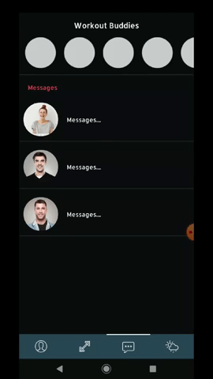
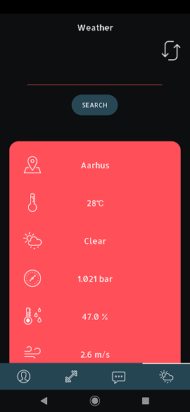

# **GymBuddy**

*An Android Development exam app*

## UI

#### Log In

*Using Firebase authorization to log in*

#### A discover tab to find yourself a new workout partner

*Swipe and like the people you have similar workout routines with*

#### Profile tab fetches a users data from Firebase

*Possible to upload your own picture*

#### Message your workout partners

***This feature is not finished - but this will be the general layout***

## Functionality

#### Firebase

* Authorization
* Data Storage

#### Room

* Local Data Storage
* Offline capabilities
* Data persistency

#### API

***The reason for using weathermap API is due to exam requirements***

* Fetch live data from weathermap.org
* Updates automatically

## Code

#### Design Patterns

*This project uses MVVM as it's structural design pattern*

#### Components

This app uses components such as:

* RecyclerView

* ViewPager - *For image carousel and the general layout*

* External open-source UI components

